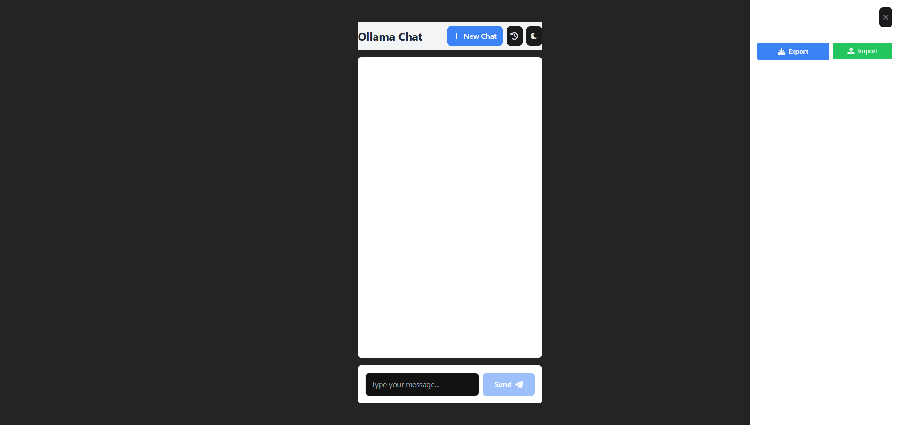

# Ollama Chat UI React

A modern React-based chat interface for Ollama, featuring a beautiful UI built with shadcn/ui components and Tailwind CSS.



## Features

- 🎨 Modern, responsive UI with shadcn/ui components
- 🌓 Dark/Light mode support
- 💻 Code syntax highlighting with VS Code-like theme
- 🤖 Multiple AI model support
- 📋 Copy code functionality
- 💬 Real-time chat interface
- 🔄 Loading states and error handling

## Tech Stack

- **Frontend Framework**: React + Vite
- **UI Components**: shadcn/ui
- **Styling**: Tailwind CSS
- **Code Highlighting**: Prism.js
- **Icons**: Font Awesome

## Prerequisites

- Node.js (Latest LTS version)
- Ollama running locally
- Git

## Installation

1. Clone the repository:
```bash
git clone https://github.com/abdelazizelm/ai-chat-ui-react.git
cd ai-chat-ui-react
```

2. Install dependencies:
```bash
npm install
```

3. Start the development server:
```bash
npm run dev
```

4. Open your browser and navigate to `http://localhost:5173`

## Available Models

The chat interface supports various Ollama models including:
- llama2
- codellama
- mistral
- mixtral
- neural-chat
- starling-lm
- phi

## Usage

1. Select your preferred model from the dropdown
2. Type your message in the input field
3. Press Enter or click the send button
4. View the AI's response with beautifully formatted code blocks

## Contributing

Contributions are welcome! Please feel free to submit a Pull Request.

## License

MIT License

## Acknowledgments

- [Ollama](https://ollama.ai/) for the amazing AI models
- [shadcn/ui](https://ui.shadcn.com/) for the beautiful UI components
- [Tailwind CSS](https://tailwindcss.com/) for the styling system
- [Prism.js](https://prismjs.com/) for code highlighting
